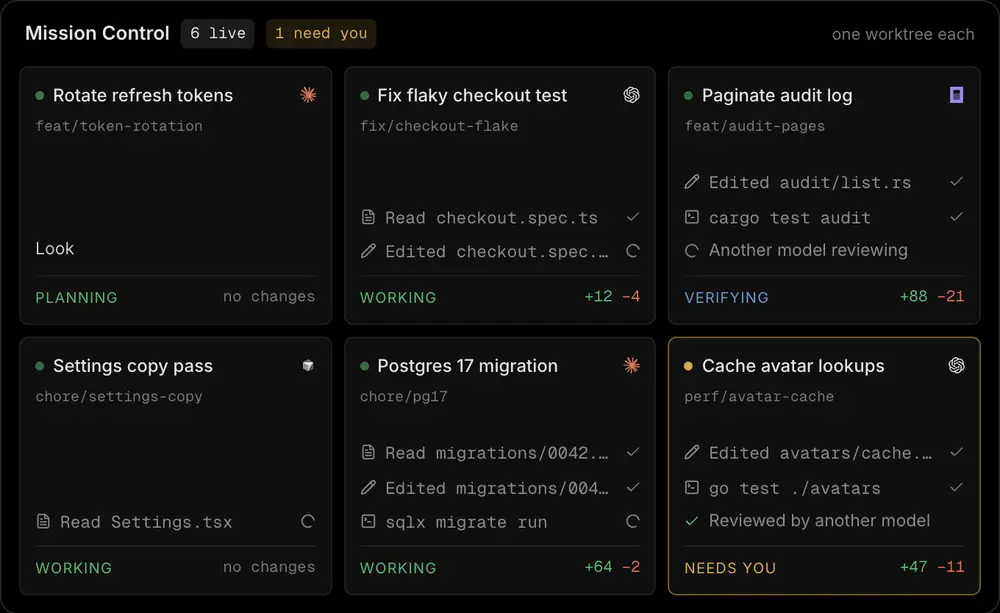
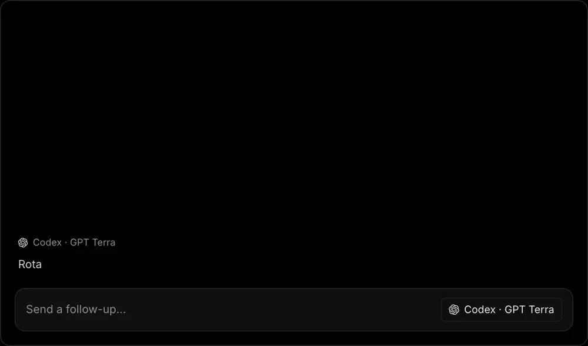
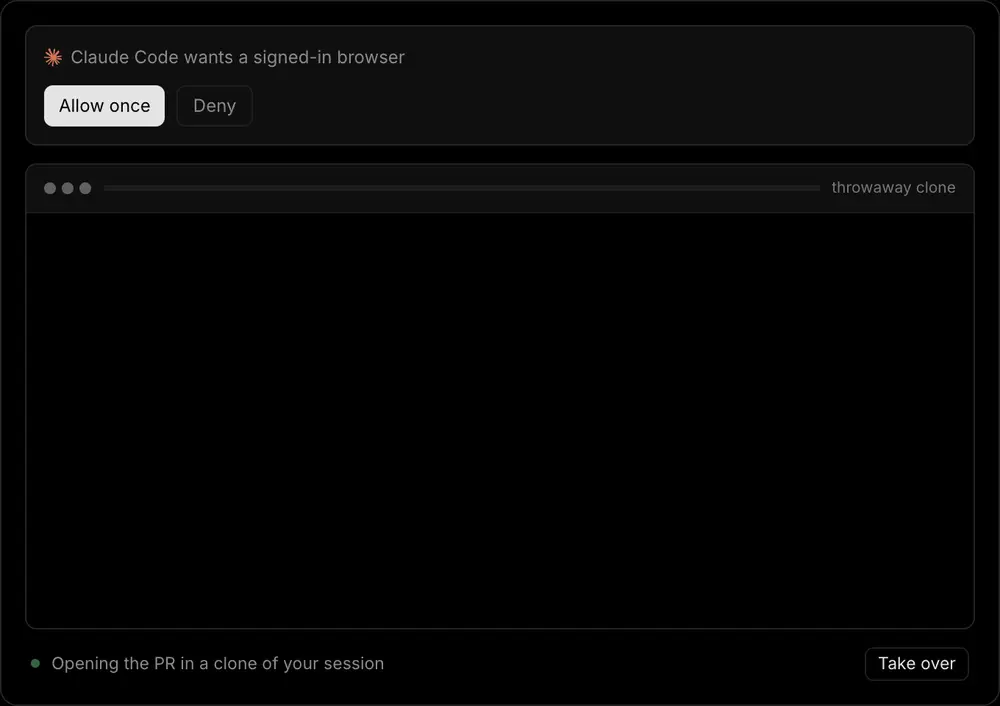
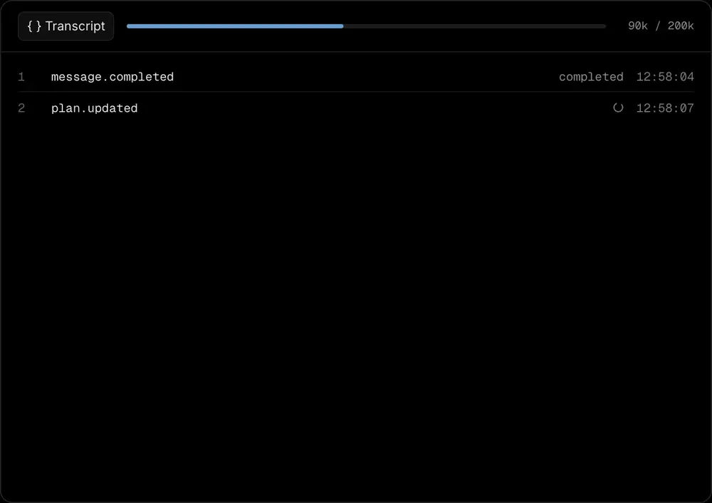
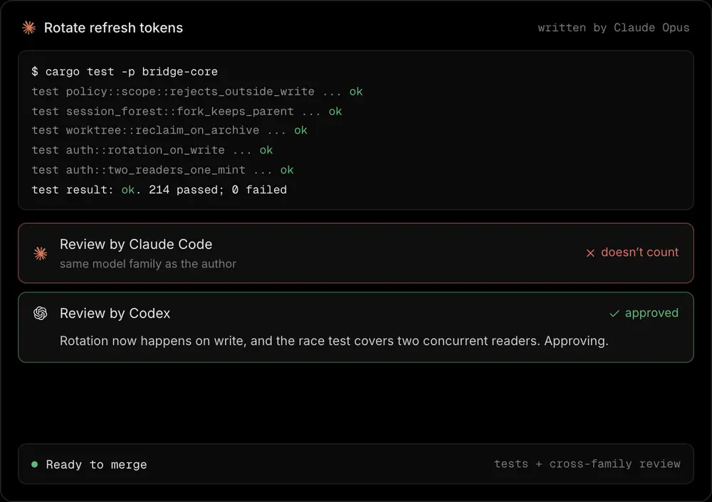
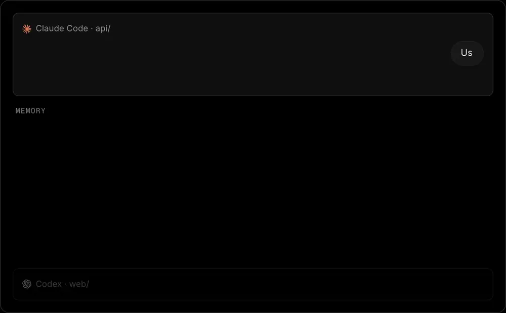
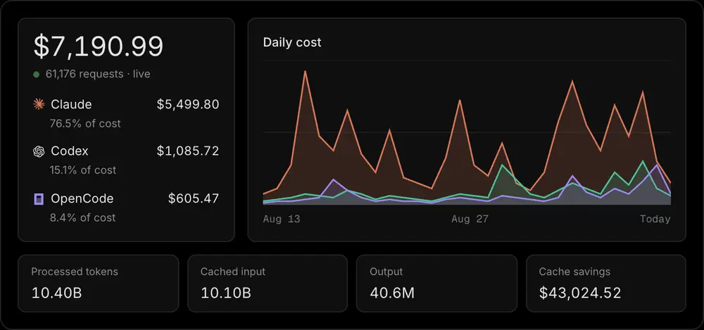

<h1 align="center">Bridge</h1>

<p align="center">
  <strong>The last coding agent you'll ever need.</strong><br/>
  Claude Code, Codex, Cursor, OpenCode, and Grok, running as one team in one window, on your own subscriptions.
</p>

<p align="center">
  <a href="https://bridge.agentclash.dev/download"><strong>Download for macOS</strong></a>
  ·
  <a href="https://bridge.agentclash.dev">Website</a>
  ·
  <a href="https://bridge.agentclash.dev/changelog">Changelog</a>
</p>

<p align="center">
  <sub>macOS 12+ · Apple Silicon · Early-stage, under active development</sub>
</p>

<p align="center">
  <a href="https://github.com/Atharva-Kanherkar/bridge-harness/actions/workflows/ci.yml"></a>
  <a href="LICENSE"></a>
  <a href="https://github.com/Atharva-Kanherkar/bridge-harness/issues"></a>
</p>

<p align="center">
  
</p>

---

## Ship more, babysit less.

Bridge is a native desktop app for running AI coding agents on real projects. Point it at a Git repository, start the agents you want, and let them work in parallel while you review what lands. Your code and your credentials stay on your machine.

### Every agent on its own branch

Run as many agents as you like on one repo. Every chat gets its own Git worktree and branch, so they never step on each other's files. Mission Control shows them side by side and flags the one waiting on you.

<p align="center">
  
</p>

### Switch harness mid-chat

Change model or provider inside one conversation, Codex to Claude Code to Cursor, without starting over. The provider session restarts; your history stays where it is. Nobody else lets you do this.

<p align="center">
  
</p>

### A real browser, signed in as you

When an agent needs a site you're logged into, it asks. Approve it and the agent drives a throwaway copy of your session: it can click through a deploy preview or a dashboard, and you can take over at any point. The copy is thrown away when the turn ends.

<p align="center">
  
</p>

### Nothing gets lost

Every message, plan, tool call, and delegation lands in a local log that only ever grows. When the context window fills, Bridge compacts the model's view and leaves the log alone, so a restart picks up from a verified checkpoint instead of a blank page.

<p align="center">
  
</p>

### No agent grades its own homework

Tests run first. Then a reviewer from a different model family has to sign off, and a review from the family that wrote the code is thrown out. Claude's work gets checked by Codex, and the other way round.

<p align="center">
  
</p>

### Tell it once

Preferences, decisions, and constraints get saved as you work and come back in any later chat, whichever agent is running and whichever repo it's in. Every reply shows which memories it used.

<p align="center">
  
</p>

### Spend less by delegating

Narrow work goes to a cheap tier and only the hard parts reach an expensive one. Tokens, cost, and cache savings break out per harness and per model, so the routing pays for itself visibly.

<p align="center">
  
</p>

### And the rest of the app

- **Set up in one screen.** First launch finds the agents you already have, installs the ones you want, and runs each provider's own sign-in.
- **You approve the risky parts.** Commands, writes outside the agreed scope, and delegation pause for one click.
- **Review every diff where it happened**, ranked by blast radius, before anything lands.
- **Agent Fleet** runs the CLIs themselves in a terminal grid per checkout.
- **Stay connected to GitHub.** Browse issues and pull requests and keep the conversation tied to the code under review.

<p align="center">
  
</p>

<p align="center">
  
</p>

## Works with your subscriptions

| Agent | CLI | Bridge can install it |
| --- | --- | --- |
| Codex | `codex` | Yes |
| Claude Code | `claude` (needs Node.js 18+) | Yes |
| OpenCode | `opencode` | Yes |
| Cursor | `cursor-agent` | Yes |
| Grok | `grok` | Install it yourself |

Sign-in always runs the vendor's own login command. Bridge never collects, stores, or logs your provider credentials.

Missing an agent? It simply shows as unavailable — Bridge still starts and everything else keeps working. Your own installs always take precedence over the ones Bridge manages.

## Get started

1. **Download Bridge** from [the download page](https://bridge.agentclash.dev/download) or [GitHub Releases](https://github.com/Atharva-Kanherkar/bridge-harness/releases) — open the `.dmg`, drag **Bridge** into Applications, and launch it.
2. **Pick your agents** — first launch shows what's already on your machine and installs or signs in to the rest.
3. **Add a project** — pick a local Git repository.
4. **Start working** — create a workspace, pick your agent and model, and send your first message.

Approvals, history, and usage tracking are on from the start.

## Download

- **Release builds:** [GitHub Releases](https://github.com/Atharva-Kanherkar/bridge-harness/releases) — look for `Bridge_*.dmg`, signed with a Developer ID, notarized, and stapled
- **Requirements:** macOS 12 or later (Apple Silicon), Git, and Node.js 18+ (only needed for Claude sessions)
- **Linux:** Debian, AppImage, and Arch packages build in CI as release candidates. They are not published downloads yet — see [docs/linux-release.md](docs/linux-release.md).
- **Updates:** signed macOS builds check GitHub Releases on launch and offer to download, install, and restart when a newer signed update is available. You can always install a DMG manually; see the [CHANGELOG](CHANGELOG.md) for what's new.

> [!NOTE]
> Bridge is early-stage software. Expect rough edges and frequent improvements. macOS may ask for file access the first time Bridge touches `Desktop`, `Documents`, or `Downloads` — keeping repos in a folder like `~/Code` avoids repeated prompts.

## Learn more

- [CHANGELOG](CHANGELOG.md) — what shipped in each release
- [docs/session-forest.md](docs/session-forest.md) — how history, rewind, and resume behave
- [docs/delegation-policy.md](docs/delegation-policy.md) — how supervised multi-agent work stays bounded
- [docs/compaction-and-resume.md](docs/compaction-and-resume.md) — checkpoints and session restoration
- [docs/managed-agent-runtimes.md](docs/managed-agent-runtimes.md) — how Bridge installs and verifies agent runtimes
- [docs/worktree-lifecycle.md](docs/worktree-lifecycle.md) — how task workspaces are created and reclaimed
- [docs/protocol/README.md](docs/protocol/README.md) — the RPC contract between the app and the runtime
- [docs/work-brief.md](docs/work-brief.md) — the daily work briefing

## Contributing

Bridge is a **Tauri 2** app with a **Rust** workspace under `src-tauri/` and a **React + TypeScript + Vite** frontend styled with **Tailwind CSS v4**, managed with **Bun**.

See **[CONTRIBUTING.md](CONTRIBUTING.md)** for prerequisites, the full command table (`bun run dev`, `bun run tauri dev`, `bun run check`, `bun run build`, `bun run test`), pull request expectations, and issue etiquette ([`docs/issue-format.md`](docs/issue-format.md) — every issue needs **For humans** and **For agents** sections).

Agent and UI conventions: **[AGENTS.md](AGENTS.md)**.

<details>
<summary><strong>Quickstart (from source)</strong></summary>

```sh
git clone https://github.com/Atharva-Kanherkar/bridge-harness.git
cd bridge-harness
bun install
bun run dev        # fast frontend iteration (mock data, no Rust shell)
bun run tauri dev  # full desktop app
```

Before opening a PR:

```sh
bun run build
bun run test
```

Keep changes focused and follow [AGENTS.md](AGENTS.md) (Tailwind CSS v4 only,
colocated tests). PR titles must use Conventional Commit syntax (`feat:`,
`fix:`, `docs:`, `chore:`), and PRs are squash-merged so that title becomes the
release commit. `fix:` releases a patch, `feat:` a minor, and `!` marks a major
version.

Release Please maintains one release PR. Squash-merging that PR creates a
version tag and draft release; production CI signs and notarizes the exact tagged
build, runs the packaged app and its bundled daemon from the mounted DMG in a
credential-free job, and publishes only after every gate passes. See the
[macOS release guide](docs/macos-release.md) for credentials, verification, and
recovery.

</details>

## License

Bridge is open source under the [MIT License](LICENSE). Use it, fork it, ship it.

Third-party code carries its own terms; see [THIRD_PARTY_NOTICES.md](THIRD_PARTY_NOTICES.md).
